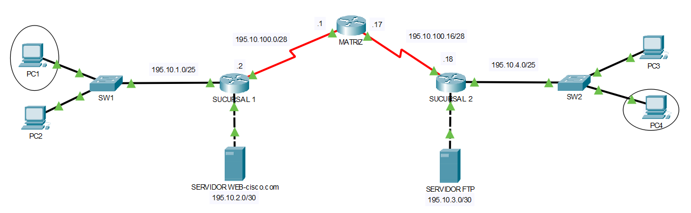

# Laboratorio 02: NAT Dinámico

## Objetivo
Implementar y verificar la configuración de NAT Dinámico en un router Cisco, asignando de manera dinámica direcciones IP públicas de un *pool* disponible a las direcciones IP privadas que solicitan acceso al exterior.

## Topología de la Red

La topología base consta de tres routers principales: **SUCURSAL 1**, **MATRIZ** y **SUCURSAL 2**.
*   El router **MATRIZ** interconecta las dos sucursales a través de enlaces seriales.
*   **SUCURSAL 1** conecta una LAN de computadoras (PC1, PC2) y un servidor web.
*   **SUCURSAL 2** conecta una LAN (PC3, PC4) y un servidor FTP.

## Conceptos Clave de Configuración

La configuración de NAT Dinámico requiere los siguientes pasos fundamentales:
1.  **Identificar las interfaces internas y externas:** Se debe especificar qué interfaces del router participan en la traducción utilizando los comandos `ip nat inside` e `ip nat outside`.
2.  **Crear un rango de direcciones externas:** Se define un *pool* de direcciones IP públicas disponibles para la traducción mediante el comando `ip nat pool name ip-inicial ip-final netmask máscara de red`.
3.  **Crear ACL estándar:** Se utiliza una Lista de Control de Acceso (ACL) para permitir la traducción de las direcciones internas específicas mediante el comando `access-list número lista permit red comodin`.
4.  **Vincular la ACL al rango de direcciones:** Se asocia la lista de acceso creada con el *pool* de direcciones públicas usando el comando `ip nat inside source list número pool name`.

## Análisis de la Configuración en SUCURSAL 1

En este escenario, el router **SUCURSAL 1** ejecuta el proceso de NAT Dinámico con los siguientes parámetros:

*   **Interfaces NAT:** La interfaz `GigabitEthernet0/0` está configurada como `ip nat inside`, mientras que la interfaz `Serial0/0/0` está configurada como `ip nat outside`.
*   **Pool NAT:** Se creó un rango llamado `NAT-SUCURSAL1` que va desde la IP `195.10.100.5` hasta la `195.10.100.10`, con una máscara de red `255.255.255.240`.
*   **Lista de Acceso (ACL):** Se configuró la `access-list 10` que permite el tráfico de la red interna `195.10.1.0` utilizando la *wildcard* `0.0.0.127`.
*   **Vinculación NAT:** La regla activa es `ip nat inside source list 10 pool NAT-SUCURSAL1`, la cual enlaza el tráfico permitido por la ACL 10 con el *pool* de IPs públicas definido.

## Archivos de Configuración

Los scripts completos para cada equipo se encuentran en la carpeta `/configs`:
*   [Router SUCURSAL 1](./configs/SUCURSAL1.txt)
*   [Router SUCURSAL 2](./configs/SUCURSAL2.txt)
*   [Router MATRIZ](./configs/MATRIZ.txt)
